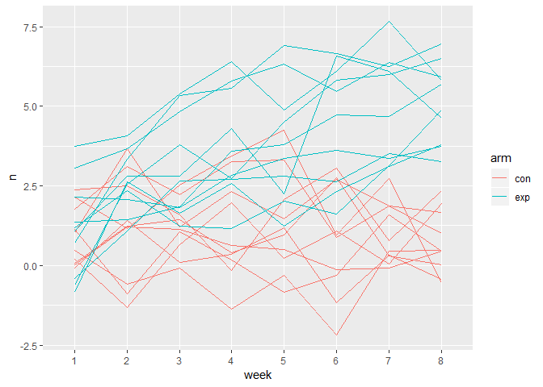

p8105\_hw5\_bjl2150
================
Briana Lettsome
November 9th, 2018

Problem 1
=========

``` r
# Made a dataframe with all the file names
long = tibble(longitudinal = list.files(path = "./data", full.names = TRUE),
              map(longitudinal, read_csv)) %>% 
  janitor::clean_names() %>%
  unnest()
```

    ## Parsed with column specification:
    ## cols(
    ##   week_1 = col_double(),
    ##   week_2 = col_double(),
    ##   week_3 = col_double(),
    ##   week_4 = col_double(),
    ##   week_5 = col_double(),
    ##   week_6 = col_double(),
    ##   week_7 = col_double(),
    ##   week_8 = col_double()
    ## )
    ## Parsed with column specification:
    ## cols(
    ##   week_1 = col_double(),
    ##   week_2 = col_double(),
    ##   week_3 = col_double(),
    ##   week_4 = col_double(),
    ##   week_5 = col_double(),
    ##   week_6 = col_double(),
    ##   week_7 = col_double(),
    ##   week_8 = col_double()
    ## )
    ## Parsed with column specification:
    ## cols(
    ##   week_1 = col_double(),
    ##   week_2 = col_double(),
    ##   week_3 = col_double(),
    ##   week_4 = col_double(),
    ##   week_5 = col_double(),
    ##   week_6 = col_double(),
    ##   week_7 = col_double(),
    ##   week_8 = col_double()
    ## )
    ## Parsed with column specification:
    ## cols(
    ##   week_1 = col_double(),
    ##   week_2 = col_double(),
    ##   week_3 = col_double(),
    ##   week_4 = col_double(),
    ##   week_5 = col_double(),
    ##   week_6 = col_double(),
    ##   week_7 = col_double(),
    ##   week_8 = col_double()
    ## )
    ## Parsed with column specification:
    ## cols(
    ##   week_1 = col_double(),
    ##   week_2 = col_double(),
    ##   week_3 = col_double(),
    ##   week_4 = col_double(),
    ##   week_5 = col_double(),
    ##   week_6 = col_double(),
    ##   week_7 = col_double(),
    ##   week_8 = col_double()
    ## )
    ## Parsed with column specification:
    ## cols(
    ##   week_1 = col_double(),
    ##   week_2 = col_double(),
    ##   week_3 = col_double(),
    ##   week_4 = col_double(),
    ##   week_5 = col_double(),
    ##   week_6 = col_double(),
    ##   week_7 = col_double(),
    ##   week_8 = col_double()
    ## )
    ## Parsed with column specification:
    ## cols(
    ##   week_1 = col_double(),
    ##   week_2 = col_double(),
    ##   week_3 = col_double(),
    ##   week_4 = col_double(),
    ##   week_5 = col_double(),
    ##   week_6 = col_double(),
    ##   week_7 = col_double(),
    ##   week_8 = col_double()
    ## )
    ## Parsed with column specification:
    ## cols(
    ##   week_1 = col_double(),
    ##   week_2 = col_double(),
    ##   week_3 = col_double(),
    ##   week_4 = col_double(),
    ##   week_5 = col_double(),
    ##   week_6 = col_double(),
    ##   week_7 = col_double(),
    ##   week_8 = col_double()
    ## )
    ## Parsed with column specification:
    ## cols(
    ##   week_1 = col_double(),
    ##   week_2 = col_double(),
    ##   week_3 = col_double(),
    ##   week_4 = col_double(),
    ##   week_5 = col_double(),
    ##   week_6 = col_double(),
    ##   week_7 = col_double(),
    ##   week_8 = col_double()
    ## )
    ## Parsed with column specification:
    ## cols(
    ##   week_1 = col_double(),
    ##   week_2 = col_double(),
    ##   week_3 = col_double(),
    ##   week_4 = col_double(),
    ##   week_5 = col_double(),
    ##   week_6 = col_double(),
    ##   week_7 = col_double(),
    ##   week_8 = col_double()
    ## )
    ## Parsed with column specification:
    ## cols(
    ##   week_1 = col_double(),
    ##   week_2 = col_double(),
    ##   week_3 = col_double(),
    ##   week_4 = col_double(),
    ##   week_5 = col_double(),
    ##   week_6 = col_double(),
    ##   week_7 = col_double(),
    ##   week_8 = col_double()
    ## )
    ## Parsed with column specification:
    ## cols(
    ##   week_1 = col_double(),
    ##   week_2 = col_double(),
    ##   week_3 = col_double(),
    ##   week_4 = col_double(),
    ##   week_5 = col_double(),
    ##   week_6 = col_double(),
    ##   week_7 = col_double(),
    ##   week_8 = col_double()
    ## )
    ## Parsed with column specification:
    ## cols(
    ##   week_1 = col_double(),
    ##   week_2 = col_double(),
    ##   week_3 = col_double(),
    ##   week_4 = col_double(),
    ##   week_5 = col_double(),
    ##   week_6 = col_double(),
    ##   week_7 = col_double(),
    ##   week_8 = col_double()
    ## )

    ## Parsed with column specification:
    ## cols(
    ##   week_1 = col_double(),
    ##   week_2 = col_double(),
    ##   week_3 = col_double(),
    ##   week_4 = col_double(),
    ##   week_5 = col_double(),
    ##   week_6 = col_double(),
    ##   week_7 = col_integer(),
    ##   week_8 = col_double()
    ## )

    ## Parsed with column specification:
    ## cols(
    ##   week_1 = col_double(),
    ##   week_2 = col_double(),
    ##   week_3 = col_double(),
    ##   week_4 = col_double(),
    ##   week_5 = col_double(),
    ##   week_6 = col_double(),
    ##   week_7 = col_double(),
    ##   week_8 = col_double()
    ## )
    ## Parsed with column specification:
    ## cols(
    ##   week_1 = col_double(),
    ##   week_2 = col_double(),
    ##   week_3 = col_double(),
    ##   week_4 = col_double(),
    ##   week_5 = col_double(),
    ##   week_6 = col_double(),
    ##   week_7 = col_double(),
    ##   week_8 = col_double()
    ## )
    ## Parsed with column specification:
    ## cols(
    ##   week_1 = col_double(),
    ##   week_2 = col_double(),
    ##   week_3 = col_double(),
    ##   week_4 = col_double(),
    ##   week_5 = col_double(),
    ##   week_6 = col_double(),
    ##   week_7 = col_double(),
    ##   week_8 = col_double()
    ## )
    ## Parsed with column specification:
    ## cols(
    ##   week_1 = col_double(),
    ##   week_2 = col_double(),
    ##   week_3 = col_double(),
    ##   week_4 = col_double(),
    ##   week_5 = col_double(),
    ##   week_6 = col_double(),
    ##   week_7 = col_double(),
    ##   week_8 = col_double()
    ## )
    ## Parsed with column specification:
    ## cols(
    ##   week_1 = col_double(),
    ##   week_2 = col_double(),
    ##   week_3 = col_double(),
    ##   week_4 = col_double(),
    ##   week_5 = col_double(),
    ##   week_6 = col_double(),
    ##   week_7 = col_double(),
    ##   week_8 = col_double()
    ## )
    ## Parsed with column specification:
    ## cols(
    ##   week_1 = col_double(),
    ##   week_2 = col_double(),
    ##   week_3 = col_double(),
    ##   week_4 = col_double(),
    ##   week_5 = col_double(),
    ##   week_6 = col_double(),
    ##   week_7 = col_double(),
    ##   week_8 = col_double()
    ## )

### Description of the dataset

This dataset contains results of subjects who were a part of an experiment. There were twenty subjects (ten assigned to the control arm and ten assigned to the exerimental arm, respectively). The zipfile, which contained the data, was comprised of twenty Excel per subject (twenty files in total). Each Excel spreadsheet contained observatios over the eight weeks that they were followed.

``` r
# Created this dataframe in order to extract the control 'arm' to be later added to another dataframe.
long_tidy = separate(long, longitudinal, into = c("control_arm", "id.csv", "period"), sep = "_") %>%
  select(-period) %>%
  separate(control_arm, into = c("data", "arm"), sep = "/data/") %>%
  select(-data, -id.csv, -(week_1:week_8))
```

    ## Warning: Expected 3 pieces. Missing pieces filled with `NA` in 20 rows [1,
    ## 2, 3, 4, 5, 6, 7, 8, 9, 10, 11, 12, 13, 14, 15, 16, 17, 18, 19, 20].

``` r
# Created a new dataframe in order to get make the 'subject_id' through wrangling of the data.
two_long_tidy = long %>% 
  separate(longitudinal, into = c("control_arm", "id.csv", "data"), sep = "/") %>%
  select(-id.csv) %>%
  separate(data, into = c("subject_id", "csv"), sep = ".csv") %>%
  select(-control_arm, -csv) 

# Combined the two above dataframes to ensure that the 'arm' variable was included in the final dataframe.
final = cbind(long_tidy, two_long_tidy)


# Tidying the dataframe so that variable 'week' is in one column rather than spread out.
long_gather = gather(final, key = week, value = n, week_1:week_8) %>%
  separate(week, into = c("number", "week"), sep = "_") %>%
  select(-number)
```

Problem 1.2
-----------

``` r
# Making of spaghetti plot showing observations on each subject over time.
long_spaghetti = long_gather %>%
  distinct() %>%
  group_by(subject_id) 
  
## It works!!!
ggplot(long_spaghetti, aes(x = week, y = n, group = subject_id, color = arm)) + 
  geom_path()
```



Problem 2
=========

``` r
# Reading in the homicide data
library(tidyverse)
library(rvest)
library(httr)

homicide_data = read_csv(file = "./homicidedata.csv")
```

    ## Parsed with column specification:
    ## cols(
    ##   uid = col_character(),
    ##   reported_date = col_integer(),
    ##   victim_last = col_character(),
    ##   victim_first = col_character(),
    ##   victim_race = col_character(),
    ##   victim_age = col_character(),
    ##   victim_sex = col_character(),
    ##   city = col_character(),
    ##   state = col_character(),
    ##   lat = col_double(),
    ##   lon = col_double(),
    ##   disposition = col_character()
    ## )

### Description of raw data:

The homicide\_data shows the numbers of homicides within the

``` r
# Making of the new variable 'city_state'
homicide_citystate = homicide_data %>%
  mutate(city_state = str_c(city, ", " , state)) %>%
  select(disposition, city_state)

# Data wragling and tidying of dataframe to get the 'total_homicides' and 'unsolved_homicides' variables
homicide_summarize = homicide_citystate %>% 
  group_by(disposition, city_state) %>%
  summarize(n = n()) %>%
  spread(key = disposition, value = n) %>%
  janitor::clean_names() %>%
  mutate(total_homicides = closed_by_arrest + closed_without_arrest + open_no_arrest) %>%
  mutate(unsolved_homicides = closed_without_arrest + open_no_arrest) %>%
  select(city_state, total_homicides, unsolved_homicides)
```

Problem 2.2
-----------

### Utilzation of prop.test

``` r
# Filtered out Baltimore, MD from the homicide_summarize dataframe.
baltimore = homicide_summarize %>%
  filter(city_state == "Baltimore, MD") 

# Using the prop.test function in order to get the proportions in Baltimore.
# Made the resulting test into and R oject named 'baltimore_propr.
  
baltimore_propr = prop.test(1825,2827, p=0.05) 

# Used the broom::tidy function in order to tidy up the resulting ouput. Then selected the estimate, and low and high confidence intervals.
baltimore_propr %>%
  broom::tidy() %>%
  select(estimate, conf.low, conf.high)
```

    ## # A tibble: 1 x 3
    ##   estimate conf.low conf.high
    ##      <dbl>    <dbl>     <dbl>
    ## 1    0.646    0.628     0.663

Problem 2.3
-----------

city\_wide\_propr = map(homicide\_summarize$city\_state, prop.test)

\`\`\` map(weather\_nest$data, ~lm(tmax ~ tmin, data = .x))
