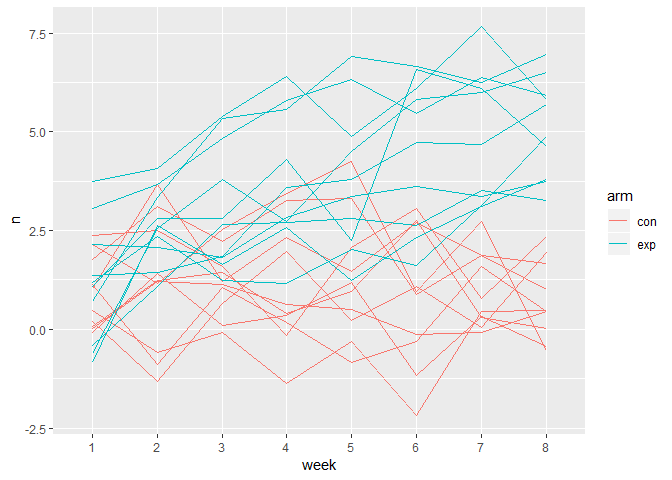

p8105\_hw5\_bjl2150
================
Briana Lettsome
November 9th, 2018

Problem 1
=========

``` r
# Made a dataframe with all the file names
long = tibble(longitudinal = list.files(path = "./data", full.names = TRUE),
              map(longitudinal, read_csv)) %>% 
  janitor::clean_names() %>%
  unnest()
```

    ## Parsed with column specification:
    ## cols(
    ##   week_1 = col_double(),
    ##   week_2 = col_double(),
    ##   week_3 = col_double(),
    ##   week_4 = col_double(),
    ##   week_5 = col_double(),
    ##   week_6 = col_double(),
    ##   week_7 = col_double(),
    ##   week_8 = col_double()
    ## )
    ## Parsed with column specification:
    ## cols(
    ##   week_1 = col_double(),
    ##   week_2 = col_double(),
    ##   week_3 = col_double(),
    ##   week_4 = col_double(),
    ##   week_5 = col_double(),
    ##   week_6 = col_double(),
    ##   week_7 = col_double(),
    ##   week_8 = col_double()
    ## )
    ## Parsed with column specification:
    ## cols(
    ##   week_1 = col_double(),
    ##   week_2 = col_double(),
    ##   week_3 = col_double(),
    ##   week_4 = col_double(),
    ##   week_5 = col_double(),
    ##   week_6 = col_double(),
    ##   week_7 = col_double(),
    ##   week_8 = col_double()
    ## )
    ## Parsed with column specification:
    ## cols(
    ##   week_1 = col_double(),
    ##   week_2 = col_double(),
    ##   week_3 = col_double(),
    ##   week_4 = col_double(),
    ##   week_5 = col_double(),
    ##   week_6 = col_double(),
    ##   week_7 = col_double(),
    ##   week_8 = col_double()
    ## )
    ## Parsed with column specification:
    ## cols(
    ##   week_1 = col_double(),
    ##   week_2 = col_double(),
    ##   week_3 = col_double(),
    ##   week_4 = col_double(),
    ##   week_5 = col_double(),
    ##   week_6 = col_double(),
    ##   week_7 = col_double(),
    ##   week_8 = col_double()
    ## )
    ## Parsed with column specification:
    ## cols(
    ##   week_1 = col_double(),
    ##   week_2 = col_double(),
    ##   week_3 = col_double(),
    ##   week_4 = col_double(),
    ##   week_5 = col_double(),
    ##   week_6 = col_double(),
    ##   week_7 = col_double(),
    ##   week_8 = col_double()
    ## )
    ## Parsed with column specification:
    ## cols(
    ##   week_1 = col_double(),
    ##   week_2 = col_double(),
    ##   week_3 = col_double(),
    ##   week_4 = col_double(),
    ##   week_5 = col_double(),
    ##   week_6 = col_double(),
    ##   week_7 = col_double(),
    ##   week_8 = col_double()
    ## )
    ## Parsed with column specification:
    ## cols(
    ##   week_1 = col_double(),
    ##   week_2 = col_double(),
    ##   week_3 = col_double(),
    ##   week_4 = col_double(),
    ##   week_5 = col_double(),
    ##   week_6 = col_double(),
    ##   week_7 = col_double(),
    ##   week_8 = col_double()
    ## )
    ## Parsed with column specification:
    ## cols(
    ##   week_1 = col_double(),
    ##   week_2 = col_double(),
    ##   week_3 = col_double(),
    ##   week_4 = col_double(),
    ##   week_5 = col_double(),
    ##   week_6 = col_double(),
    ##   week_7 = col_double(),
    ##   week_8 = col_double()
    ## )
    ## Parsed with column specification:
    ## cols(
    ##   week_1 = col_double(),
    ##   week_2 = col_double(),
    ##   week_3 = col_double(),
    ##   week_4 = col_double(),
    ##   week_5 = col_double(),
    ##   week_6 = col_double(),
    ##   week_7 = col_double(),
    ##   week_8 = col_double()
    ## )
    ## Parsed with column specification:
    ## cols(
    ##   week_1 = col_double(),
    ##   week_2 = col_double(),
    ##   week_3 = col_double(),
    ##   week_4 = col_double(),
    ##   week_5 = col_double(),
    ##   week_6 = col_double(),
    ##   week_7 = col_double(),
    ##   week_8 = col_double()
    ## )
    ## Parsed with column specification:
    ## cols(
    ##   week_1 = col_double(),
    ##   week_2 = col_double(),
    ##   week_3 = col_double(),
    ##   week_4 = col_double(),
    ##   week_5 = col_double(),
    ##   week_6 = col_double(),
    ##   week_7 = col_double(),
    ##   week_8 = col_double()
    ## )
    ## Parsed with column specification:
    ## cols(
    ##   week_1 = col_double(),
    ##   week_2 = col_double(),
    ##   week_3 = col_double(),
    ##   week_4 = col_double(),
    ##   week_5 = col_double(),
    ##   week_6 = col_double(),
    ##   week_7 = col_double(),
    ##   week_8 = col_double()
    ## )

    ## Parsed with column specification:
    ## cols(
    ##   week_1 = col_double(),
    ##   week_2 = col_double(),
    ##   week_3 = col_double(),
    ##   week_4 = col_double(),
    ##   week_5 = col_double(),
    ##   week_6 = col_double(),
    ##   week_7 = col_integer(),
    ##   week_8 = col_double()
    ## )

    ## Parsed with column specification:
    ## cols(
    ##   week_1 = col_double(),
    ##   week_2 = col_double(),
    ##   week_3 = col_double(),
    ##   week_4 = col_double(),
    ##   week_5 = col_double(),
    ##   week_6 = col_double(),
    ##   week_7 = col_double(),
    ##   week_8 = col_double()
    ## )
    ## Parsed with column specification:
    ## cols(
    ##   week_1 = col_double(),
    ##   week_2 = col_double(),
    ##   week_3 = col_double(),
    ##   week_4 = col_double(),
    ##   week_5 = col_double(),
    ##   week_6 = col_double(),
    ##   week_7 = col_double(),
    ##   week_8 = col_double()
    ## )
    ## Parsed with column specification:
    ## cols(
    ##   week_1 = col_double(),
    ##   week_2 = col_double(),
    ##   week_3 = col_double(),
    ##   week_4 = col_double(),
    ##   week_5 = col_double(),
    ##   week_6 = col_double(),
    ##   week_7 = col_double(),
    ##   week_8 = col_double()
    ## )
    ## Parsed with column specification:
    ## cols(
    ##   week_1 = col_double(),
    ##   week_2 = col_double(),
    ##   week_3 = col_double(),
    ##   week_4 = col_double(),
    ##   week_5 = col_double(),
    ##   week_6 = col_double(),
    ##   week_7 = col_double(),
    ##   week_8 = col_double()
    ## )
    ## Parsed with column specification:
    ## cols(
    ##   week_1 = col_double(),
    ##   week_2 = col_double(),
    ##   week_3 = col_double(),
    ##   week_4 = col_double(),
    ##   week_5 = col_double(),
    ##   week_6 = col_double(),
    ##   week_7 = col_double(),
    ##   week_8 = col_double()
    ## )
    ## Parsed with column specification:
    ## cols(
    ##   week_1 = col_double(),
    ##   week_2 = col_double(),
    ##   week_3 = col_double(),
    ##   week_4 = col_double(),
    ##   week_5 = col_double(),
    ##   week_6 = col_double(),
    ##   week_7 = col_double(),
    ##   week_8 = col_double()
    ## )

### Description of the dataset

``` r
# Created this dataframe in order to extract the control 'arm' to be later added to another dataframe.
long_tidy = separate(long, longitudinal, into = c("control_arm", "id.csv", "period"), sep = "_") %>%
  select(-period) %>%
  separate(control_arm, into = c("data", "arm"), sep = "/data/") %>%
  select(-data, -id.csv, -(week_1:week_8))
```

    ## Warning: Expected 3 pieces. Missing pieces filled with `NA` in 20 rows [1,
    ## 2, 3, 4, 5, 6, 7, 8, 9, 10, 11, 12, 13, 14, 15, 16, 17, 18, 19, 20].

``` r
# Created a new datafram in order to get make the 'subject_id' through wrangling of the data.
two_long_tidy = long %>% 
  separate(longitudinal, into = c("control_arm", "id.csv", "data"), sep = "/") %>%
  select(-id.csv) %>%
  separate(data, into = c("subject_id", "csv"), sep = ".csv") %>%
  select(-control_arm, -csv) 

# Combined the two dataframes to ensure that the 'arm' variable was included in the final dataframe.
final = cbind(long_tidy, two_long_tidy)


# Tidying the dataframe so that variable 'week' is in one column rather than spread out.
long_gather = gather(final, key = week, value = n, week_1:week_8) %>%
  separate(week, into = c("number", "week"), sep = "_") %>%
  select(-number)

# Making of spaghetti plot shwoing observations on each subject over time.
long_spaghetti = long_gather %>%
  distinct() %>%
  group_by(subject_id) 
  
## It works!!!
ggplot(long_spaghetti, aes(x = week, y = n, group = subject_id, color = arm)) + 
  geom_path()
```



brfss\_smart2010 %&gt;% select(year, locationabbr, locationdesc) %&gt;% distinct() %&gt;% group\_by(year) %&gt;% count(locationabbr) %&gt;% ggplot(aes(x = year, y = n, group = locationabbr, color = locationabbr)) + geom\_path() + labs(title = "Location count for each state by year") + viridis::scale\_color\_viridis( name = "locationabbr", discrete = TRUE)

brfss\_spaghetti = brfss %&gt;% group\_by(locationabbr, year) %&gt;% distinct(locationdesc) %&gt;% summarize(location\_numbers = n()) %&gt;% ggplot(aes(x = year, y = location\_numbers, color = locationabbr)) + geom\_line()

Problem 2
=========

``` r
# Reading in the homicide data
library(tidyverse)
library(rvest)
library(httr)

homicide_data = read_csv(file = "./homicidedata.csv")
```

    ## Parsed with column specification:
    ## cols(
    ##   uid = col_character(),
    ##   reported_date = col_integer(),
    ##   victim_last = col_character(),
    ##   victim_first = col_character(),
    ##   victim_race = col_character(),
    ##   victim_age = col_character(),
    ##   victim_sex = col_character(),
    ##   city = col_character(),
    ##   state = col_character(),
    ##   lat = col_double(),
    ##   lon = col_double(),
    ##   disposition = col_character()
    ## )

### Description of raw data:

The homicide\_data shows the numbers of homicides within the

``` r
# Making of the new variable 'city_state'
homicide_citystate = homicide_data %>%
  mutate(city_state = str_c(city, ", " , state)) %>%
  select(disposition, city_state)


homicide_summarize = homicide_citystate %>% 
  group_by(disposition, city_state) %>%
  summarize(n = n()) %>%
  spread(key = disposition, value = n) %>%
  janitor::clean_names()
```

mutate(visit = str\_replace(visit, "bdi\_score\_", "")

str(homicide\_summarize)


      mutate(total_homicides = )

      separate(disposition, into = C("Closed by arrest", "Closed without arrest", "Open/No arrest")
      mutate(Closed = filter(disposition == "Closed without arrest"))
           
           %>%
    mutate(unsolved_homicides = recode(disposition != "Close by arrest"))


    homicide_summarize = homicide_citystate %>% 
    mutate(total_homicide = disposition) %>%
    mutate(unsolved_homicides = recode(disposition != "Close by arrest"))


    mutate(unsolved_homicides = filter(disposition %in% c("Closed without arrest", "Open/No arrest")))
      
      homicide_summarize %>%
      group_by(city_state, disposition) %>%
      count()

    balitmore = homicide_summarize %>%
      filter(city_state == "Baltimore, MD") %>%
      prop.test

homicide\_summarize = homicide\_citystate %&gt;% filter(disposition %in% c("Closed without arrest", "Open/No arrest")) %&gt;% mutate(unsolved\_homicides = recode(disposition, "disposition" = "Open/No arrest", disposition = "Closed without arrest")) %&gt;% group\_by(city\_state, disposition, unsolved\_homicides) %&gt;% count()
