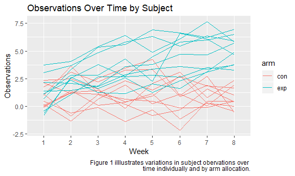

p8105\_hw5\_bjl2150
================
Briana Lettsome
November 9th, 2018

Problem 1
=========

``` r
# Made a dataframe with all of the file names

long = tibble(longitudinal = list.files(path = "./data", full.names = TRUE),
              map(longitudinal, read_csv)) %>% 
  janitor::clean_names() %>%
  unnest()
```

    ## Parsed with column specification:
    ## cols(
    ##   week_1 = col_double(),
    ##   week_2 = col_double(),
    ##   week_3 = col_double(),
    ##   week_4 = col_double(),
    ##   week_5 = col_double(),
    ##   week_6 = col_double(),
    ##   week_7 = col_double(),
    ##   week_8 = col_double()
    ## )
    ## Parsed with column specification:
    ## cols(
    ##   week_1 = col_double(),
    ##   week_2 = col_double(),
    ##   week_3 = col_double(),
    ##   week_4 = col_double(),
    ##   week_5 = col_double(),
    ##   week_6 = col_double(),
    ##   week_7 = col_double(),
    ##   week_8 = col_double()
    ## )
    ## Parsed with column specification:
    ## cols(
    ##   week_1 = col_double(),
    ##   week_2 = col_double(),
    ##   week_3 = col_double(),
    ##   week_4 = col_double(),
    ##   week_5 = col_double(),
    ##   week_6 = col_double(),
    ##   week_7 = col_double(),
    ##   week_8 = col_double()
    ## )
    ## Parsed with column specification:
    ## cols(
    ##   week_1 = col_double(),
    ##   week_2 = col_double(),
    ##   week_3 = col_double(),
    ##   week_4 = col_double(),
    ##   week_5 = col_double(),
    ##   week_6 = col_double(),
    ##   week_7 = col_double(),
    ##   week_8 = col_double()
    ## )
    ## Parsed with column specification:
    ## cols(
    ##   week_1 = col_double(),
    ##   week_2 = col_double(),
    ##   week_3 = col_double(),
    ##   week_4 = col_double(),
    ##   week_5 = col_double(),
    ##   week_6 = col_double(),
    ##   week_7 = col_double(),
    ##   week_8 = col_double()
    ## )
    ## Parsed with column specification:
    ## cols(
    ##   week_1 = col_double(),
    ##   week_2 = col_double(),
    ##   week_3 = col_double(),
    ##   week_4 = col_double(),
    ##   week_5 = col_double(),
    ##   week_6 = col_double(),
    ##   week_7 = col_double(),
    ##   week_8 = col_double()
    ## )
    ## Parsed with column specification:
    ## cols(
    ##   week_1 = col_double(),
    ##   week_2 = col_double(),
    ##   week_3 = col_double(),
    ##   week_4 = col_double(),
    ##   week_5 = col_double(),
    ##   week_6 = col_double(),
    ##   week_7 = col_double(),
    ##   week_8 = col_double()
    ## )
    ## Parsed with column specification:
    ## cols(
    ##   week_1 = col_double(),
    ##   week_2 = col_double(),
    ##   week_3 = col_double(),
    ##   week_4 = col_double(),
    ##   week_5 = col_double(),
    ##   week_6 = col_double(),
    ##   week_7 = col_double(),
    ##   week_8 = col_double()
    ## )
    ## Parsed with column specification:
    ## cols(
    ##   week_1 = col_double(),
    ##   week_2 = col_double(),
    ##   week_3 = col_double(),
    ##   week_4 = col_double(),
    ##   week_5 = col_double(),
    ##   week_6 = col_double(),
    ##   week_7 = col_double(),
    ##   week_8 = col_double()
    ## )
    ## Parsed with column specification:
    ## cols(
    ##   week_1 = col_double(),
    ##   week_2 = col_double(),
    ##   week_3 = col_double(),
    ##   week_4 = col_double(),
    ##   week_5 = col_double(),
    ##   week_6 = col_double(),
    ##   week_7 = col_double(),
    ##   week_8 = col_double()
    ## )
    ## Parsed with column specification:
    ## cols(
    ##   week_1 = col_double(),
    ##   week_2 = col_double(),
    ##   week_3 = col_double(),
    ##   week_4 = col_double(),
    ##   week_5 = col_double(),
    ##   week_6 = col_double(),
    ##   week_7 = col_double(),
    ##   week_8 = col_double()
    ## )
    ## Parsed with column specification:
    ## cols(
    ##   week_1 = col_double(),
    ##   week_2 = col_double(),
    ##   week_3 = col_double(),
    ##   week_4 = col_double(),
    ##   week_5 = col_double(),
    ##   week_6 = col_double(),
    ##   week_7 = col_double(),
    ##   week_8 = col_double()
    ## )
    ## Parsed with column specification:
    ## cols(
    ##   week_1 = col_double(),
    ##   week_2 = col_double(),
    ##   week_3 = col_double(),
    ##   week_4 = col_double(),
    ##   week_5 = col_double(),
    ##   week_6 = col_double(),
    ##   week_7 = col_double(),
    ##   week_8 = col_double()
    ## )

    ## Parsed with column specification:
    ## cols(
    ##   week_1 = col_double(),
    ##   week_2 = col_double(),
    ##   week_3 = col_double(),
    ##   week_4 = col_double(),
    ##   week_5 = col_double(),
    ##   week_6 = col_double(),
    ##   week_7 = col_integer(),
    ##   week_8 = col_double()
    ## )

    ## Parsed with column specification:
    ## cols(
    ##   week_1 = col_double(),
    ##   week_2 = col_double(),
    ##   week_3 = col_double(),
    ##   week_4 = col_double(),
    ##   week_5 = col_double(),
    ##   week_6 = col_double(),
    ##   week_7 = col_double(),
    ##   week_8 = col_double()
    ## )
    ## Parsed with column specification:
    ## cols(
    ##   week_1 = col_double(),
    ##   week_2 = col_double(),
    ##   week_3 = col_double(),
    ##   week_4 = col_double(),
    ##   week_5 = col_double(),
    ##   week_6 = col_double(),
    ##   week_7 = col_double(),
    ##   week_8 = col_double()
    ## )
    ## Parsed with column specification:
    ## cols(
    ##   week_1 = col_double(),
    ##   week_2 = col_double(),
    ##   week_3 = col_double(),
    ##   week_4 = col_double(),
    ##   week_5 = col_double(),
    ##   week_6 = col_double(),
    ##   week_7 = col_double(),
    ##   week_8 = col_double()
    ## )
    ## Parsed with column specification:
    ## cols(
    ##   week_1 = col_double(),
    ##   week_2 = col_double(),
    ##   week_3 = col_double(),
    ##   week_4 = col_double(),
    ##   week_5 = col_double(),
    ##   week_6 = col_double(),
    ##   week_7 = col_double(),
    ##   week_8 = col_double()
    ## )
    ## Parsed with column specification:
    ## cols(
    ##   week_1 = col_double(),
    ##   week_2 = col_double(),
    ##   week_3 = col_double(),
    ##   week_4 = col_double(),
    ##   week_5 = col_double(),
    ##   week_6 = col_double(),
    ##   week_7 = col_double(),
    ##   week_8 = col_double()
    ## )
    ## Parsed with column specification:
    ## cols(
    ##   week_1 = col_double(),
    ##   week_2 = col_double(),
    ##   week_3 = col_double(),
    ##   week_4 = col_double(),
    ##   week_5 = col_double(),
    ##   week_6 = col_double(),
    ##   week_7 = col_double(),
    ##   week_8 = col_double()
    ## )

### Description of the raw dataset:

This dataset contained results of subjects who were a part of an experiment. There were twenty subjects (ten assigned to the control arm and ten assigned to the exerimental arm, respectively) who were followed for a period of time. The zipfile was comprised of an Excel file per subject (twenty files in total). Each Excel spreadsheet contained observations over the eight weeks that the subjects they stuided. The experiment was a longitudinal study.

The 'map' function was used to iterate and read in all of the Excel files from the zipped folder.

``` r
# Created this dataframe in order to extract the control 'arm' to be later added to another dataframe.

long_tidy = separate(long, longitudinal, into = c("control_arm", "id.csv", "period"), sep = "_") %>%
  select(-period) %>%
  separate(control_arm, into = c("data", "arm"), sep = "/data/") %>%
  select(-data, -id.csv, -(week_1:week_8))
```

    ## Warning: Expected 3 pieces. Missing pieces filled with `NA` in 20 rows [1,
    ## 2, 3, 4, 5, 6, 7, 8, 9, 10, 11, 12, 13, 14, 15, 16, 17, 18, 19, 20].

``` r
# Created a new dataframe in order to get make the 'subject_id' through wrangling of the data.

two_long_tidy = long %>% 
  separate(longitudinal, into = c("control_arm", "id.csv", "data"), sep = "/") %>%
  select(-id.csv) %>%
  separate(data, into = c("subject_id", "csv"), sep = ".csv") %>%
  select(-control_arm, -csv) 

# Combined the two above dataframes to ensure that the 'arm' variable was included in the final dataframe.

final = cbind(long_tidy, two_long_tidy)


# Tidying the dataframe so that variable 'week' is in one column rather than spread out.

long_gather = gather(final, key = week, value = n, week_1:week_8) %>%
  separate(week, into = c("number", "week"), sep = "_") %>%
  select(-number)
```

Problem 1.2
-----------

``` r
# Doing some more data wwrangling to 'group_by' the 'subject_id' variable.

long_spaghetti = long_gather %>%
  distinct() %>%
  group_by(subject_id) 
  
# Making of spaghetti plot showing observations on each subject over time.

ggplot(long_spaghetti, aes(x = week, y = n, group = subject_id, color = arm)) + 
  geom_path() +
  labs(title = "Observations Over Time by Subject",
    x = "Week",
    y = "Observations",
    caption = "Figure 1 illlustrates variations in subject obervations over 
    time individually and by arm allocation.")
```



Figure 1 shows the observational trends by each subject in addition trends by arm allocation. The blue lines correspond to the exposed group while the red lines correspond to the control group. According to the figure, the control arm had a smaller number of results over the weeks. Contrastingly, the experiment arm had higher numbers of results over time. Given no background on the purposed of this study, this figure suggests that the exeprimental arm may have had better outcomes as a result of a trial drug that the research investigators were testing.

Problem 2
=========

``` r
# Reading in the homicide data.

library(tidyverse)
library(rvest)
library(httr)

homicide_data = read_csv(file = "./homicidedata.csv")
```

    ## Parsed with column specification:
    ## cols(
    ##   uid = col_character(),
    ##   reported_date = col_integer(),
    ##   victim_last = col_character(),
    ##   victim_first = col_character(),
    ##   victim_race = col_character(),
    ##   victim_age = col_character(),
    ##   victim_sex = col_character(),
    ##   city = col_character(),
    ##   state = col_character(),
    ##   lat = col_double(),
    ##   lon = col_double(),
    ##   disposition = col_character()
    ## )

### Description of the raw dataset:

The homicide\_data provides information on the numbers of homicides committed within fifty large U.S. cities. Within the dataset, the observations included are the vitcims' first and last name, age, race, city and state that the event transpired in as well as the disposition. The disposition in this context refers to the result of the homicide event. In other words, was the case closed, an arrest made, unsolved, et cetera.

``` r
# Making of the new variable 'city_state'.

homicide_citystate = homicide_data %>%
  mutate(city_state = str_c(city, ", " , state)) %>%
  select(disposition, city_state)

# Data wrangling and tidying of dataframe to get the 'total_homicides' and 'unsolved_homicides' variables.

homicide_summarize = homicide_citystate %>% 
  group_by(disposition, city_state) %>%
  summarize(n = n()) %>%
  spread(key = disposition, value = n) %>%
  janitor::clean_names() %>%
  mutate(total_homicides = closed_by_arrest + closed_without_arrest + open_no_arrest) %>%
  mutate(unsolved_homicides = closed_without_arrest + open_no_arrest) %>%
  select(city_state, total_homicides, unsolved_homicides)
```

Problem 2.2
-----------

### Utilzation of prop.test

### Baltimore, MD

``` r
# Filtered out 'Baltimore, MD' from the homicide_summarize dataframe.

baltimore = homicide_summarize %>%
  filter(city_state == "Baltimore, MD") 

# Using the prop.test function to gete proportions in Baltimore.
#Made the resulting test into an R object named 'baltimore_propr'.
  
baltimore_propr = prop.test(1825,2827, p=0.05) 

# Used the broom::tidy function in order to tidy up the resulting ouput. 
# Then selected the estimate as well as low and high confidence intervals.

baltimore_propr %>%
  broom::tidy() %>%
  select(estimate, conf.low, conf.high)
```

    ## # A tibble: 1 x 3
    ##   estimate conf.low conf.high
    ##      <dbl>    <dbl>     <dbl>
    ## 1    0.646    0.628     0.663

Problem 2.3
-----------

### Proportion of unsolved homicides per cities

``` r
# Used the prop.test within a mutate function in order to create a new variable. # The 'map' function was applied and then, tidying and 'unnest'ing occurred. 

city_state_propr = homicide_summarize %>%
  filter(total_homicides != "NA") %>%
  mutate(new =  map2(.x = unsolved_homicides, .y = total_homicides, ~prop.test(x = .x, n = .y))) %>%
  mutate(new =map(new, broom::tidy)) %>% 
  unnest()

# Specifically selected out the estimates and both confidence intervals columns.
# Additonally, reordered the 'city_state' variable by the 'estimate' variable.

city_state_output = city_state_propr %>%
  select(city_state, estimate, conf.low, conf.high, p.value) %>%
  mutate(city_state = forcats::fct_reorder(city_state, estimate))

# Making of the boxplot with the inclusion of error bars for low and high CIs.
# Used the 'geoom_errorbar' to complete the latter step.

city_state_output %>% 
  ggplot(aes(x = city_state, y = estimate)) + geom_boxplot() +
  theme(axis.text.x = element_text(angle = 90, hjust = 1)) + 
  geom_errorbar(aes(ymin = conf.low, ymax = conf.high)) +
  labs(
    title = "Proportion of Unsolved Homicides by City",
    x = "City",
    y = "Proportion Estimate",
    caption = "Figure 2: Data from the Washington Post"
  )
```


Figure 2 illustrates the proprtion of unsolved estimates by the fifty cities collected by the Washington Post. A boxplot was used to create the graph and the 'geom\_errorbar' function was used to obtain the error bars using the confidence intervals. According to Figure 2, Chicago, Illinios is an outlier. This indicates that it has the highest proportion of unsolved homicides of these fifty cities.In Observing the rest of the cities, there is no apparent trend in the proportion of unsolved homicides by region. Additionally, for some of the observed estimates, many of these proportions are unsignificant as evidenced by the wide error bars (ex. Tampa, Fl.).
